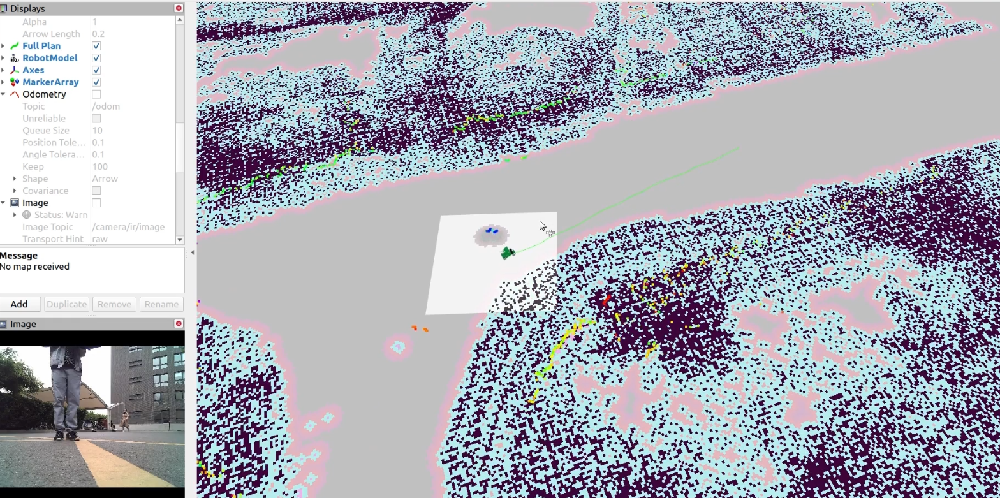

# 地图

## 前言

精确的环境表示对于自动驾驶汽车的操作极为关键。环境可以通过多种方式表示，比如二维网格地图、鸟瞰图（BEV）、三维点云、拓扑地图、高清地图等。

不同级别的自动驾驶功能可以灵活选择合适的地图表示形式。每种类型的地图都有其优势：例如，网格地图存储空间小且易于创建，但缺乏车道线等语义信息；而高清地图内容丰富，但需要持续更新，并且随着地理覆盖范围的扩大，制作成本也会相应增加。

鉴于ISSPA目前主要在其园区内部运营，因此主要采用网格地图。这些地图可通过2D SLAM、3D SLAM等方法获取，同时有多种成熟的SLAM方法可供选择，包括GMapping、Cartographer等。以下是一些演示结果。

## 网格地图

以下是ISCAS（中国科学院软件研究所）园区内生成的网格地图结果。

**网格地图示例**

网格地图是自动驾驶领域中用于表示环境的一种方式，它将周围环境划分为规则的网格单元，每个单元代表地图上的一个小区域。这种类型的地图常用于描绘车辆周围的环境，支持自动驾驶系统的感知、决策制定和路径规划等功能。

网格地图特别适合于结构化地模拟环境。网格中的每个单元可以存储对应区域的状态或特征信息，使自动驾驶车辆能够理解和导航周围环境。这种表示法通常用于传感器融合，即来自激光雷达、雷达、摄像头等多种传感器的数据可以在网格单元内整合并解读。

此外，网格地图为处理和分析空间信息提供了一个便捷的框架，有助于执行障碍物检测、定位和路线规划等任务。其规则结构和存储异构数据的能力使之成为提升自动驾驶汽车感知与决策能力的宝贵工具。