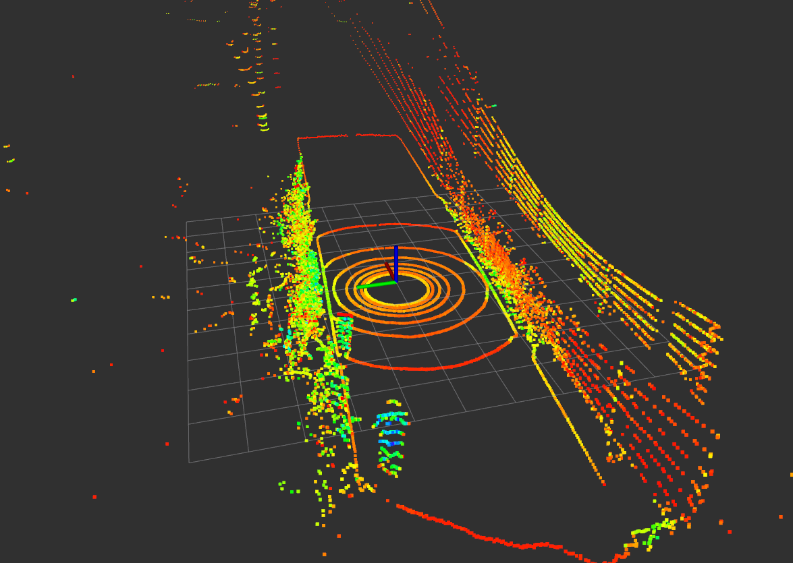
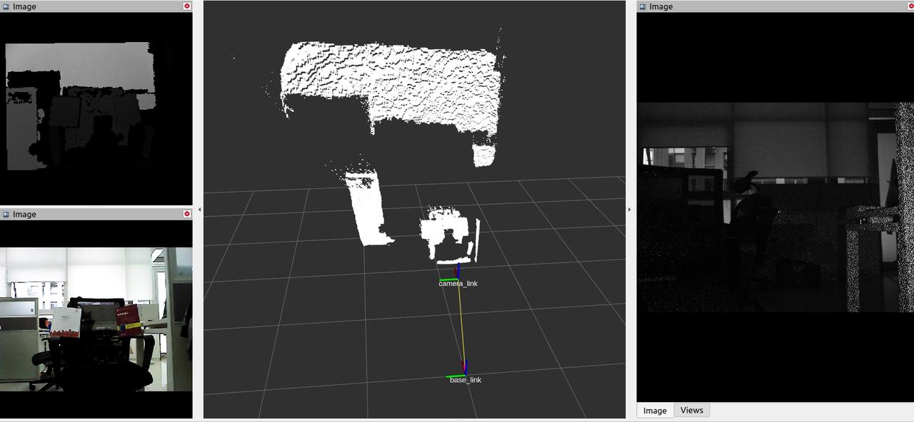

# 传感器

<a style="display: none;" rel="me" href="https://fosstodon.org/@readthedocs">Mastodon</a>

## 前言

传感器的正确部署及标准化使用对于自动驾驶汽车的稳定运行至关重要，因为其数据质量直接影响到车辆导航的安全性。在自动驾驶领域中，传感器组合通常涵盖工业相机、激光雷达（LiDAR）、毫米波雷达、GPS、惯性测量单元（IMU）等，每种传感器都有着不同的数据格式。

## ISSPA配置

ISSPA的车辆可配备单线/多线激光雷达、单目/深度相机、IMU等，为研究人员提供了多样化的选择以满足特定需求。以下是不同传感器的简要介绍：

- **激光雷达（LiDAR）**：利用激光束通过测量反射时间来获取距离，广泛应用于自动驾驶中，对实时地图构建、物体检测有着重要贡献。下图展示了一所校园内使用Velodyne 16线激光雷达采集的一帧点云数据。

  
  
  **某校园收集的激光雷达点云样本数据**

- **深度相机**：基于飞行时间（ToF）技术的深度相机利用光脉冲飞行时间的测量原理来确定物体与相机之间的距离。ToF深度相机具有速度快、精度高以及适应多种光照条件的优点，在计算机视觉、3D扫描、虚拟现实和增强现实中得到广泛应用。

  
  
  **实验室中不同模式下深度相机数据的可视化**

- **惯性测量单元（IMU）**：通过测量加速度和角速度提供车辆姿态及运动状态信息。在自动驾驶系统中，IMU常用于增强导航的准确性和稳定性。

  [IMU示例](https://www.semanticscholar.org/paper/Gait-dynamics-sensing-using-IMU-sensor-array-system-Kardos%CC%8C-Balog/55e6ad65ed6249f6a50d83cca1188b688febadc1/figure/0)

通过这些传感器的周密选择与集成，ISSPA旨在为不同场景下的各类研究需求提供灵活多样的选择方案。