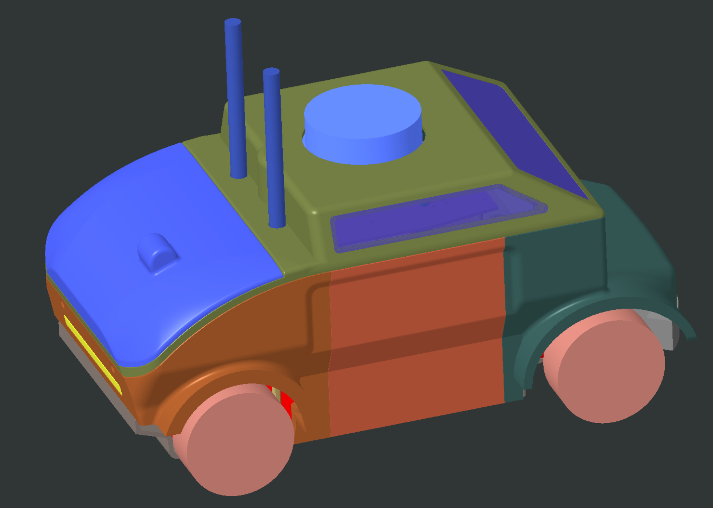

# 用户手册集合

完成工作区设置后，您可以尝试执行以下任务，包括车辆底盘启动、传感器启动、远程控制、SLAM（即时定位与地图构建）以及导航。

截至目前，以下实验车辆已获支持：

| 实验车辆   | 亮点功能               |
|------------|-----------------------|
| PAV-S      | 2D SLAM，导航         |

以下是各实验车辆的用户手册。

## PAV-S 用户手册

请参考[PAV-S用户手册](./pavs-user-manual)获取文档。

## 问题与故障排除

在编译程序和使用硬件的过程中可能会遇到许多问题，一些常见问题可参考本文档尝试解决。如未在[此处](./issue-and-troubleshooting)找到解决方案，您可以在ISSPA仓库中提交问题。